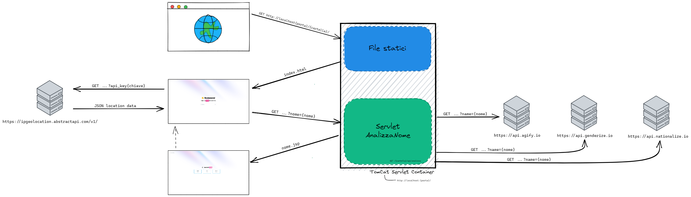

# Servlet Analizza Nome

## Struttura

## Contenuto:
- index.html: pagina html da cui viene richiamata la servlet. All'interno di essa viene inoltre fatta una richiesta ad un API per la geolocalizzazione dell'utente attraveso l'indirizzo IP ed in base al luogo viene mostrato un messaggio di benvenuto diverso. La pagina è responsive e supporta la dark mode (si attiva in automatica se attivata a livello di sistema).
- /assets/: File utili alle pagine html
- /src/: Codice sorgente della servlet che richiama tre API diverse per ottenere per un nome l'analisi della nazione, età e genere.
- build.gradle: per testare in locale viene utilizzato gradle per la gestione delle dipendenze
- nome.jsp: JSP che conterrà il risultato dell'analisi del nome.
